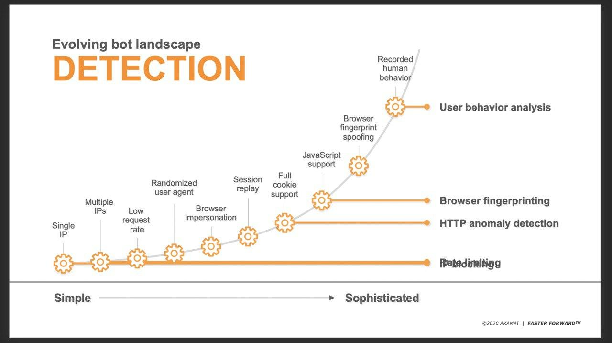

# Eric 大 CDN 分享

原討論串開頭：[https://t.me/GooayeUSA/100855](https://t.me/GooayeUSA/100855)

Eric Chuang, [26.08.20 02:13]
> 剛剛研究了一下 SHOP & BIGC 各自使用的CDN平台
> SHOP 使用 Net ，因此我想要增加Net的比重
> BIGC 使用 AKAM，因此 BIGC回頭載客的話，我會上車然後長期持有，因為 AKAM收費很貴，付得起的話，我覺得實力很優呀，SHOP流量如果持續上升，Net會收到更多錢錢，簡單分享我的資訊

Boca, [26.08.20 02:28]
> 這是查討論資料還是財報或是從主機DNS/IP判斷出來的？

Eric Chuang, [26.08.20 02:29]
> 直接從SHOP BIGC 自己的官網與他們的客戶，直接透過DNS 驗證出來的

Eric Chuang, [26.08.20 02:30]
> 非財報非年報

Alex Tzeng, [26.08.20 03:39]
> 順帶看了一下 AKAM 這家公司，發現他相比現在其他當今在炒的 CDN provider 滿不一樣的，他其實已經上市 20 年了，並且一般聊到 edge computing 對他的討論度也不太高

Alex Tzeng, [26.08.20 03:42]
> 是那種從 .com 泡沫一直活到現在的公司，並且他的 cdn 產品比起 fastly 和 net 看來是更著重資安

Eric Chuang, [26.08.20 03:51]
> 是的，沒有錯，其實他的規模非常大，賈伯斯曾經想要買下它，但是AKAM沒有要賣，到目前為止，AKAM的員工，都可以憑著AKAM的員工牌，在蘋果直營店買到9折（如果我沒有記錯的話）的商品，曾經跟著去買過，如果用便利商店來比喻，大家都去便利商店買飲料，因為近，你不會因為要買個飲料就跑到大賣場，AKAM大約就是台灣的7-11，到處都有，ＡＫＡＭ就是網路世界裡的到處都有， Net 大約就是後起之秀，規模大約就是 萊爾富，全家的級數大約就是GOOG ， ＦＳＬＹ比較像是新進入的 全聯或是美廉社
> 
> 從IT技術來說 AKAM是比較全面的，但是也是因為老，行銷模式比較老氣，Net & FSLY新，懂得用新的方式去行銷
> 
> Net FSLY 用張信用卡就可以開啟服務了。
> 
> AKAM就是要你簽合約出來，不能線上啟用，線上測試，你一定要找的賣AKAM的經銷商或是AKAM自己的銷售人員，光光就是測試，也是要簽合約的
> 
> 老派的方法，但是大公司都用呀

Eric Chuang, [26.08.20 03:56]
> 舉例來說，台灣的交通業，都有用AKAM，長榮航 華航 高鐵  OO海運  ＯＯ銀行  ＯＯ報 ，如果有興趣想知道哪些人用了，運用下列網址輸入後，就可以知道答案了
> 
> [https://www.cdnplanet.com/tools/cdnfinder/](https://www.cdnplanet.com/tools/cdnfinder/)

Eric Chuang, [26.08.20 04:03]
> 冷飯熱炒，不容易，剛開店的好炒呀，股票還是要蹭熱度，以上行業內的分享，供大家參考，小圈圈知道的優勢，不等於華爾街炒家們一定會去用的題材，所以我也去買了Fsly，只是自己會很小心，因為知道是炒上去的

Tseng Felix, [26.08.20 09:55]
> Eric大大 跟您請教一下
> Fastly/ cloudflare 的客群是用aws/azure/google buildup SaaS，但希望透過cdn 來降低頻寬成本/網路延遲的那些vender嗎？

Eric Chuang, [26.08.20 17:03]
> 需要透過網路地送出去給終端客戶的，都會需要CDN來讓客戶快速取得，例如交通業的訂票，媒體業的內容，OTT的影音、一切只要是B2C然後透過網路的，都需要CDN，至於是使用 aws / azure/ google  還是使用中華電信的IDC都沒有關係，CDN能有效的快速遞送到終端客戶、降低機房的頻寬使用、機器使用

丟高 喔, [26.08.20 17:19]
> Eric大請教一下，剛餵狗查了，原來aws/azure/google那些cloude server的供應該自己也有內含cdn；那像cloudflare的優勢在那裡? 防ddos attack ?

Eric Chuang, [26.08.20 17:27]
> 功能差距太多，azure aws gcp 在速度上沒啥問題，但是在安全功能幾乎是沒有，連抵禦機器人爬蟲的功能都不完整，也沒有邊際運算的能力，例如邊際內容壓縮，讓速度傳快點，內容保護，有版權的資料保護，這些在aws aws gcp都是殘缺的，僅有akam net fsly會做這些功能

John Doe, [26.08.20 17:29]
> 原來如此....以前公司就是習慣用NET才沒改掉 看來是對的XD

Eric Chuang, [26.08.20 17:30]
> 嗯啊

Heero Tseng, [26.08.20 17:31]
> ERIC大大 請問一些CDN廠商的細節，想知道AKAM NET FASTLY這幾家CDN的機房都是自建的嗎?還是跟電信商合作?另外未來的邊緣運算整合跟CDN會有甚麼趨勢嗎?

丟高 喔, [26.08.20 17:33]
> 嘖嘖嘖難怪我們公司租aws常常被掃，感謝回覆

Eric Chuang, [26.08.20 17:37]
> Aws太容易被掃了

Eric Chuang, [26.08.20 17:41]
> 有自己建也有合作，邊際運算是趨勢，舉例來說akam net fsly全都有提供一個套餐，例如，你提供一個4K,他可以依據客戶的需求自動轉1080p 720p 480p 240p,這樣內容提供者可以更快的上片，不用在轉成各式各樣的格式，圖片也是

Heero Tseng, [26.08.20 17:43]
> 多的功能會需要改到網站跟APP嗎?算是就是把該邊緣運算功能直接當作MICROSERVICE接給這幾家CDN?

Eric Chuang, [26.08.20 17:45]
> 不用改網站跟app，現在超進步，都不用改code,早期還需要改code

Heero Tseng, [26.08.20 17:45]
> 因為有看到微軟AWS那些開始在推邊緣運算的功能(WAVELENTH EDGE ZONE)，有些續續在講說會取代掉CDN

Eric Chuang, [26.08.20 17:46]
> 這要看架構了，有點難快速說明清楚

Abby Chang, [26.08.20 17:48]
> 想請問ERIC大，例如這個網站他們有用cloudflare (賣個性化鍵帽的，很安全XD ) [https://artkeyuniverse.com/](https://artkeyuniverse.com/) ，第一次連線進去都會在cloudflare的畫面轉好幾秒，這個時間是拿來處理什麼會花那麼久?!

Eric Chuang, [26.08.20 17:49]
> 在做機器人驗證，透過運算去看看你的瀏覽器是不是真的人在操作，防禦機器人

Sobi Huang, [26.08.20 17:51]
> 不過這樣使用者體驗會有點影響就是了

Sobi Huang, [26.08.20 17:52]
> 這是拿什麼資料去做運算啊？

Eric Chuang, [26.08.20 17:52]
> 恩啊，這方面就AKAM比較屌，透過偵測滑鼠的移動來分析，這樣就比較沒有Net這方面的問題

Abby Chang, [26.08.20 17:52]
> 原來如此，剛剛用postman去打它們網站的確都會卡在驗證頁

Eric Chuang, [26.08.20 17:53]
> Java Script

Eric Chuang, [26.08.20 17:54]
> 你可以請供應商給你白名單，讓你好好的用postman去打

John Doe, [26.08.20 18:05]
> 開個selenium 用ChromeDriver 爬網頁 如果鼠標不動 不是也跟普通人一樣?

Eric Chuang, [26.08.20 18:07]
> 恩啊，所以還有第二層第三層的分數評估，就魔高一尺道高一丈，再出新方法

Eric Chuang, [26.08.20 18:14]

> 有好幾層的機器人偵測，這也是門藝術
