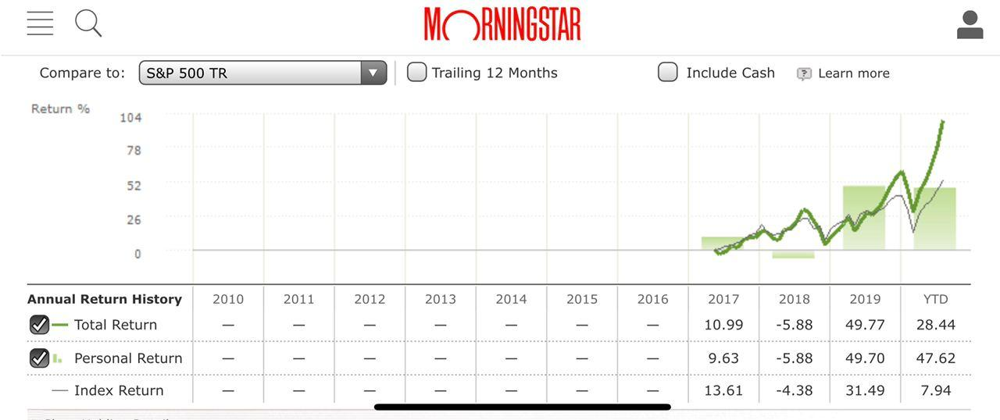

# 如何追蹤長期績效

原討論串開頭：[https://t.me/GooayeUSA/103192](https://t.me/GooayeUSA/103192)

13, [27.08.20 01:07]

>好奇大家是怎麼追蹤自己的長期績效。比如有沒有打敗大盤、手動進出對績效的影響等等。我目前是把所有的交易手動輸入 MorningStar 讓它跑出數據
>
>（一分鐘只能傳一張圖只好慢慢傳😂）

13 (01:09)

Joyce Tsai (01:10)

> 我自己用Banktivity在記帳也紀錄所有股票交易。我的部位不小而且歐美台都有，所以這個軟體對我來說非常好用，一次統整。用了10年了

Joyce Tsai (01:19)

> Banktivity介面美而且很user friendly，可以跑很多圖表，可以跑季報籌年報酬特定區間報酬隨便你設，可以切換匯率，非常方便
> 
> 不過不便宜倒是⋯⋯

Wane Wang (01:35)

> 自己輸入的紀錄股票的話還有wallmine跟equitystat
> 不過都只有網頁
> 有簡單的線圖可以跟大盤比績效

Ranger Hsaio (01:46)

> 這軟體好像只能Mac上用，請問Windows系統有推薦的嗎?

Joyce Tsai (01:52)

> [https://alternative.me/banktivity](https://alternative.me/banktivity)
> 
> 可以參考這個。Banktivity今年因為Yahoo API改了所以股價無法自動更新，還有一些銀行不再提供sync服務，已經沒有往年好用了。去年以前是電腦一打開，所有銀行明細跟股價全部自動更新完畢，非常美好⋯
