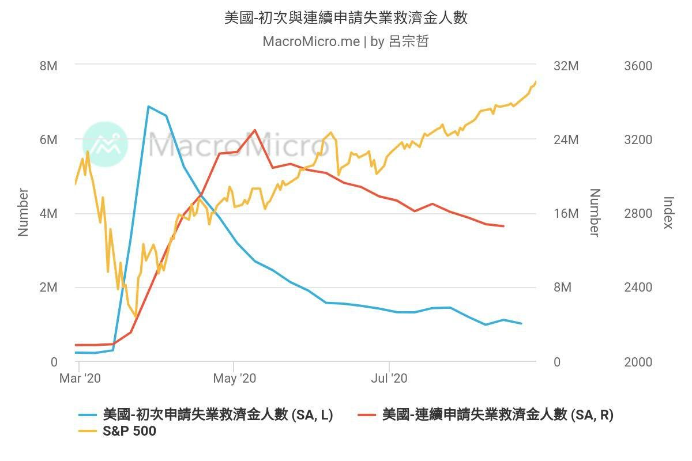
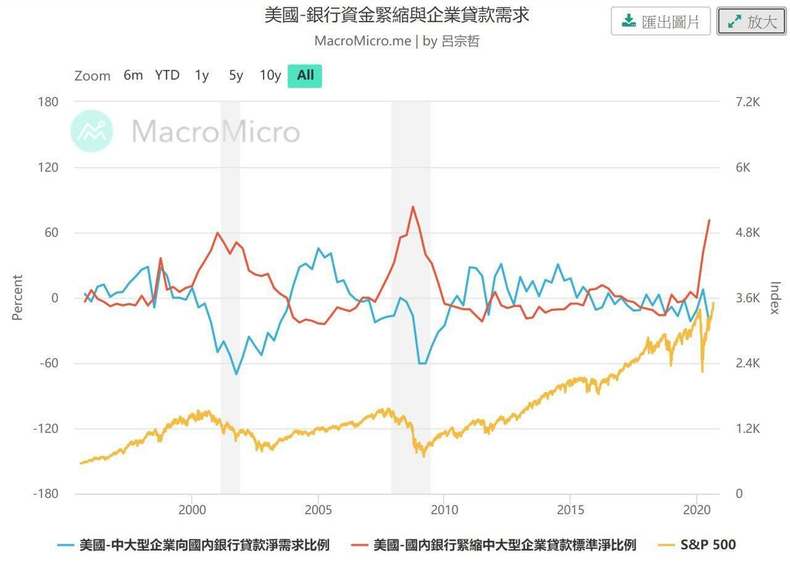

# 總體經濟

原討論串開頭：<https://t.me/GooayeUSA/110357>

VegeChicken, [31.08.20 11:41]

> 雖然大家有點嗨，而且也不是很多人關心總經這塊，小菜雞還是來風險警示一下。
>
> 總經看到風險並沒辦法預料多久後會發生：
>
> （圖一）目前初領和連續失業救助金下降趨緩，亦即勞動力水平不如疫情前，沒勞動力就沒錢就沒辦法消費（如果財政政策上沒有 support的話），以消費為主體的美國經濟將有大幅度的修正，甚至進入大衰退期。
>
> （圖二）中大型企業對銀行貸款意願下降，可能代表 1. 企業錢多到不需要跟銀行借 2. 沒看到需求不想增資生產。美國國內銀行對於中大型企業緊縮貸款標準淨比例快速攀升，代表銀行也不願意借出資金給企業。不管如何，可以從圖看出崩跌和數值有關係，計算相關係數絕對值為 0.5，前一次數據公布時間為 2020/7/20

Amber Chen, [31.08.20 11:48]

> 我有疑問，初領和連續請領失業救助金人數趨緩，不是代表勞動力水準已有回升嗎？
>
> 另外從圖二看來，中大型企業貸款需求比例與疫情前相較，似乎沒有很大落差，如何看出貸款意願下降？
>
> 不好意思問題可能很菜，還在努力學習判讀圖表中

Tim Chuang, [31.08.20 11:53]

> 貸款的圖，感覺是中型以上公司對借貸資金需求趨緩，銀行也不打算持續放款給中型以上公司
> 
> 有趣的雙向「同步」

VegeChicken, [31.08.20 11:54]

> 1. 圖一最左邊是疫情前的狀態，趨緩代表有進步沒錯，但無法回到疫情前狀態，但現在的股市可是噴出疫情前狀態。
> 2. 需求比例開始往下，這還沒辦法確認是否真的變差，下個季度如果更差，我會選擇大幅縮減股市的資金比例

Tim Chuang, [31.08.20 11:57]

> 失業救濟的圖，純粹表示請領失業救濟金人數（初領、連續領）同步減少

Amber Chen, [31.08.20 11:58]

> 好的，感謝回覆～
>
> 也謝謝分享，第一次知道還可以用銀行緊縮企業貸款標準的比例來觀察
>
> [財經 M 平方 - 美國-國內銀行緊縮企業貸款標準淨比例](https://www.macromicro.me/charts/1241/us-bank-net-percent-tight-loan)
