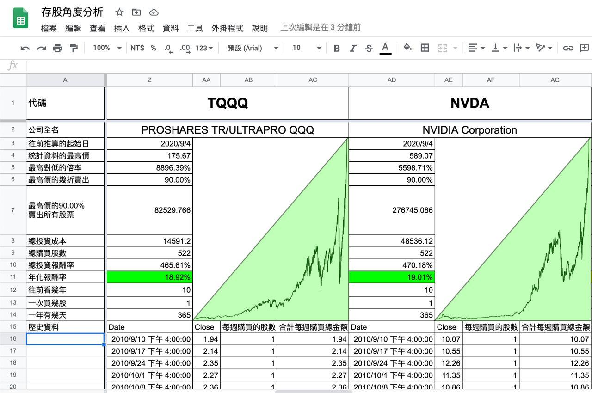

# TQQQ vs NVDA

原討論串開頭：<https://t.me/GooayeUSA/123407>

Eric Chuang, [04.09.20 17:59]

> 我算了一下，每週定投一股TQQQ vs NVDA，回測十年，這樣我會選NVDA，這樣比較好睡
>
> 加註警語：TQQQ會扣血，長期持有要非常小心，必須要理解槓桿ETF的風險

Michael Huang, [04.09.20 18:04]

> TQQQ 內扣很重的，有損耗
>
> 不是用來長期持有的請注意啊！
>
> 這種槓桿是為了讓你做短線操作而已

靠靠, [04.09.20 18:07]

> 請教一下 大家提到的內扣扣血 我一直搞不是很懂會體現在股票現貨市場的哪裡？ 是指淨值往下降造成溢價過大嗎？還是說扣血會扣在現值上面？ 現值應該是市場供需決定的不是嗎
