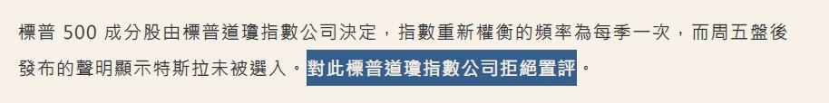

# 主委：VOO 沒特斯拉

原討論串開頭：<https://t.me/GooayeUSA/126629>

Love GG+, [05.09.20 20:16]

> 王伯達新的fb文寫說道瓊 sp500不適合作為投資用的指數xdd 其實菜雞我傻傻以為sp500是有固定模式收納公司的～看來我還真是不懂自己投資voo是投資了什麼⋯投資好難QQ

梅克斯, [05.09.20 20:18]

> sp500有人為選股的成分在裡面
> 但其實涵蓋率很高

W Y, [05.09.20 20:20]

> 有人為選股成分在內 但是涵蓋範圍蠻大的

J, [05.09.20 20:27]

> 我覺得voo不錯啊 主要還是看他的持股你喜不喜歡吧 vti是全市場 但雜魚也太多了 持有三千隻耶

MK H, [05.09.20 20:30]

> VTI 有特斯拉⋯

Hao, [05.09.20 20:30]

> VOO (S&P500) 有人為的選擇在裡面，所以其實不算被動型指數投資

MK H, [05.09.20 20:30]

> VOO 沒拉特斯拉有點可惜

Love GG+, [05.09.20 20:31]

> 我標準菜雞 沒搞懂自己買的指數是什麼⋯以為他就是有固定收納、踢出公司的規則，適合被動投資⋯不知道最後sp500還是有特定人來選誰有資格進入

Hao, [05.09.20 20:34]

> 這也是我想請問的
> VTI 涵蓋全美，而 VOO 是人為選擇的 500 大
> 所以美股並沒有像台股50一樣，純看市值挑選前幾大的指數型 ETF 嗎？ （還是其實0050也是人為挑選？我記得不是）

Aaron Huang, [05.09.20 20:34]

> 你可以買羅素1000啊

J, [05.09.20 20:35]

> 對 所以還是看自己喜不喜歡裡面的主要成份股 很喜歡特斯拉買QQQ跟ARK也不錯啊 😆

Aaron Huang, [05.09.20 20:35]

> 羅素1000 IWB

Huang Huniiiiiii, [05.09.20 20:37]

> VT也有特斯拉 只是比VTI少

MK H, [05.09.20 20:38]

> Sp500 可以啦，不用太嚴格

W Y, [05.09.20 20:38]
> 
VT都到全世界了 當然更低 XD

MK H, [05.09.20 20:38]

> 只是沒放特斯拉有點可惜雙標QQ

J, [05.09.20 20:40]
> 
> 長期看很多人要打贏S&P500都做不到啊

Saar Lai, [05.09.20 20:44]

> VOO和VTI的報酬記得是差不多的

MK H, [05.09.20 20:44]

> Voo小贏 我本來很信voo, 我喜歡大型股

MK H, [05.09.20 20:45]

> 但沒選特斯拉，從此信仰動搖

MK H, [05.09.20 20:45]

> 也不是，他本來就該選他

Chen Knight, [05.09.20 20:47]

> 還嫌特斯拉不夠大嗎XDD

Jimmy, [05.09.20 20:47]

> 目標是參與全市場成長的邏輯應該選VTI而不是VOO
> 回測報酬差異很小

MK H, [05.09.20 20:47]

> 放心，有很多人會倒給被動基金
> 
> Msci調整台股也一堆人吃豆腐

Darren 東, [05.09.20 20:48]

> 我看早上新聞寫『拒絕評論』。還有這種事情...

Steve Tseng, [05.09.20 20:49]

> 對啊，蠻怪的！為何不選？

Aaron Huang, [05.09.20 20:49]

> 可能委員會滿手 put

MK H, [05.09.20 20:49]

> 若 VOO 會刻意跳過房間裡的巨象，那我就轉去支持 VTI，反正嚴格來講報酬差不多

MK H, [05.09.20 20:49]

> 大型股 carry

Huang Huniiiiiii, [05.09.20 20:50]

> 感覺應該怪SPY委員會 VOO只是vanguard追蹤 伯格公司還是很優質的🤤內扣抵（主委習慣性喊voo)

Love GG+, [05.09.20 20:50]

> Xddd我覺得特斯拉大成這樣還刻意忽略 肯定有啥利益瓜葛 但委員會自己有利益瓜葛的，選股就毛毛的xddd

pizza LAI, [05.09.20 20:51]

> 可能比較保守吧

Huang Huniiiiiii, [05.09.20 20:52]

> 傳統能源商 汽車商？利益糾葛

MK H, [05.09.20 20:52]

> 對我習慣推voo，但現在起轉VTI
> 
> 即便其實差不多，但雙標是不對的R

MK H, [05.09.20 20:53]

> 開始這樣去忽略大型公司，就偏離我主張VOO選大公司，我愛大公司的本質

Peri, [05.09.20 20:55]

> 「Msci調整台股也一堆人吃豆腐」《可以請主委解釋詳細一點嗎？大概知道這回事，但怎麼運作不清楚

MK H, [05.09.20 20:56]

> 現在很難了，早期常聽到
> 
> 就是MSCI 調整日會爆大量，新增成分股可以炒高倒給被動基金接（實際上那個月就會開始動了）

Peri, [05.09.20 20:58]

> 懂了，因為調整後被動基金不得不買，手上有大貨的就先抬價，讓成交價提高，多賺一點
> 感謝主委🙏🏻

henbangderworld, [05.09.20 21:02]
> (更)
> 標普選的標準是連四季GAAP有賺。
> 但特斯拉好像是non-GAAP、GAAP都有賺
> 委員會密室協商叭叭，拒買SPY

MK H, [05.09.20 21:10]

> 有達標喔
