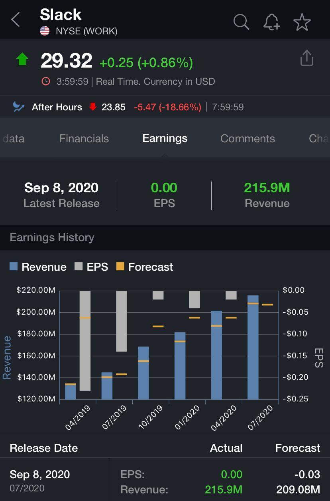

# Slack

John Doe, [09.09.20 10:02]

> slack 明明蠻多人用的 是因為免費版太好用 所以營收都拉不起來嗎？

Ting-Wei Hsu, [09.09.20 10:04]

> 我在美國 實驗室本來用Slack 現在學校全都改成Teams了 微軟整合到outlook更好用

John Doe, [09.09.20 10:12]

> [Forwarded from IEObserve 國際經濟觀察]
> 
> 作為一直沒有跟上漲勢的雲端股，Slack也公布了第二季的財報營收獲利都優於預期，全年展望也調高但盤後股價照崩18%不誤，其實相對其他估值真的飄上雲端的SaaS，Slack崩完後的估值是現在市場少見的平實
> 
> 當然主要還是他跟他的對手其實沒有太大的不可取代差異，而且它的對手還免費套裝送，讓他很難有大幅成長的空間，還是一堆公司是免費仔在用
> 
> Slack Technologies二季度付費客户超過13萬家，同比增長30%；年經常性收入超過10萬美元的付費客户985家，同比增長37%；使用共享渠道的付費客户超過5.2萬户，比上季度末的4.1萬多户有所增長；超過38萬家機構使用免費或付費訂閲計劃，同比增長超200%。
