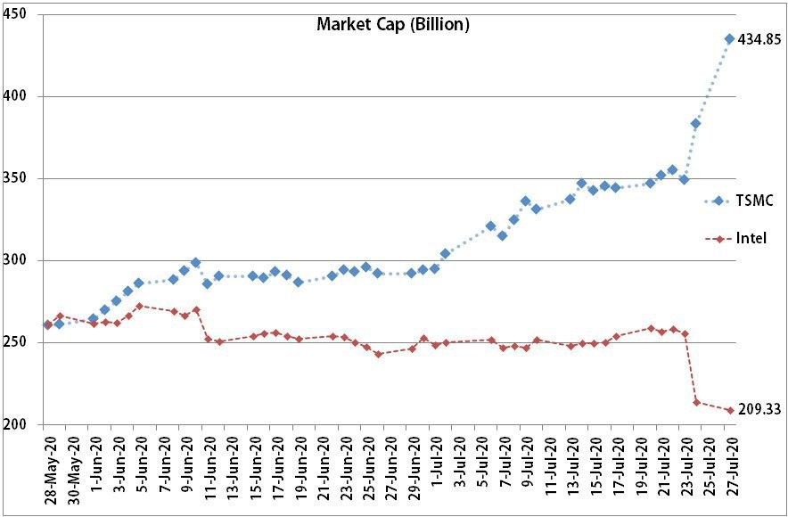

# NVDIA 拿下 ARM 對 Intel 影響

SamLin YSL, [15.09.20 21:58]

> NVIDIA 拿下 Arm ，蘋果與高通或許有點介意，但受傷的可能是英特爾  
> 繼續閱讀: <http://technews.tw/?p=646854>  
> -分享自 科技新報 App  

John Wang, [15.09.20 22:22]

> 不是可能受傷  
> 是一定受傷
> 
> 兩個月前我做了一張圖  
> TSMC跟Intel的市值比較圖  
> 今年五月以前兩家市值差不多  
> 但是7月底台積電連續兩天跳空  
> 同時間Intel大跌  
> 可從圖看到台積電市值已經大幅超越  
> 且是Intel的兩倍左右  
> 
> 市場已經告訴我們答案  
> 誰是半導體界的新霸主  
> 過去Intel稱霸幾十年  
> 接下來要換人了  
> 而且不是短期現象  
> 我是看很長期樂觀看待  
> 
> 好幾年前台積電在28奈米大舉投資跟擴廠  
> 就此甩開競爭對手並拉近第一名的距離  
> 到現在台積電再度大舉投資跟擴廠  
> 已經預告未來  
> 
> 在我眼中Intel是家好公司  
> 有非常好的設計跟研發能力  
> 但是我一股都不想持有  
> 買了一堆TSM大聯盟  
> 
> 真心希望Intel製程良率不要卡關太久  
> 如果我是Intel CEO  
> 我會把製造部門關掉  
> 轉型為IC design house  
> 