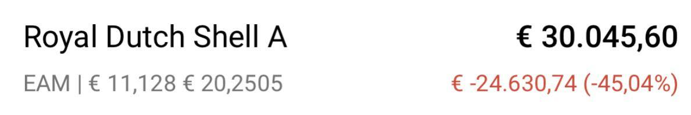

# Joyce 大分享 RDS 經驗

原討論串開頭：<https://t.me/GooayeUSA/161038>

gugu, [25.09.20 23:48]
> 請問大家 會因為  
>  已經 盤算好的買點 和賣點 沒有買 賣到  
> 得失心  重  
> 感覺天空很灰藍嗎？

Joyce Tsai, [25.09.20 23:55]
> 你覺得灰灰的就來找大夥取暖，我可以再貼我的RDS給你看，你會頓時豁然開朗

gugu, [25.09.20 23:57]
> RDS是什麼？

Joyce Tsai, [25.09.20 23:59]

> 來來來⋯

Wind Lu, [26.09.20 00:00]
> 小輸我之前的uso

Joyce Tsai, [26.09.20 00:00]
> 我不想贏這種⋯⋯

Wind Lu, [26.09.20 00:03]
> 我之前在谷底認賠。 然後就不太買自己不懂的東西。 之前買的時候沒搞懂他的機制。 只覺得很便宜

Joyce Tsai, [26.09.20 00:09]
> 這也是種幸運，賠過大錢才有更深的體悟，而且你有本錢賠大錢也是種幸福。Shell我跟它有四年的感情，唉丟卡慘兮，而它還是有讓我繼續留著的理由，我真把它當定存，每年3%還是能接受

Wind Lu, [26.09.20 00:17]
> 那一陣子波動很大。 所以壓力也不小只好清空，還好前一陣子美股狂漲賺回了虧掉的錢。

Joyce Tsai, [26.09.20 01:04]
> 👍 厲害，這就成功了😊 果然有風
> 
> 其實我所有投資都還不錯，就這個最慘，但因為投資標的很分散，所以對單一標的風險承受度非常高，每天還是可以睡很好（所以各位癌友，主委跟M大的話要聽！分散不要亂all in）而且我覺得有個坑在那裡會讓你比較積極地去經營主動投資的部分，所以我現在整體投資組合還是正的。所謂失敗為成功之母，RDS就是我老母。我10年前還在一檔做過假賬的陸資Nasdaq ADR公司賠了兩萬美金，也是要花點力氣把賠的賺回來，這筆算我祖母
> 
> 賠過大錢會非常認同巴爺爺的最高原則- 不要賠錢，而諷刺的是，人都是要賠過才真知道怎麼不再賠。所以，年輕的時候多犯錯多賠點沒關係，因為你還有時間賺回來，不要失心瘋就好

LIN, [26.09.20 01:26]
> RDSB算是賠錢嗎？當初買的時候不就看好未來兩年以後了...？

Joyce Tsai, [26.09.20 01:29]
> 當初買從不是為了價差，如果只是為了價差我早跑了，這麼穩的公司沒想到會崩，所以根本措手不及。嚴格說我沒賣是真的沒賠也沒錯，但市場的價格就放在那裡給你看，還是要認的

比翁阿爾米斯, [26.09.20 01:32]
> 可是面對一直隕落 其實心裏怎麽想 像是三月的時候 是當教訓 在哪裏一直告誡自己嗎？像大大們都説過 認錯砍了 把錢在投資別的> 標 不會是讓錢從新活動嗎？我只是小菜雞 純粹真的好奇想問你這件事 謝謝你哦

Joyce Tsai, [26.09.20 01:38]
> 我第一件去確認的事，就是這間公司會不會倒，所以我第一次認真看它們的年報跟季報就是在三月底四月初崩盤時。看完確認真的不大可能倒後，就轉移注意力去看其他標的了。這一路沒什麼很大的心情起伏，頗冷血。不過我覺得這是因為我這些錢都不會影響我家的生計，給了我有理性冷血的本錢

比翁阿爾米斯, [26.09.20 01:40]
> 非常謝謝你的回應 受教受教

Joyce Tsai, [26.09.20 01:46]
> 不用那麼客氣😄 多少有點職業病，我做財務時都是處理很棘手的事，而且讀財報抓重點很快，比較能評斷一間公司財務體質的好壞，這對信仰有很大的加持作用。我覺得大家是真的可以考慮去上點基礎財務課，作為輔助工具
