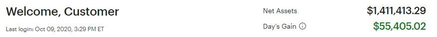

# PTON

原討論串開頭：<https://t.me/GooayeUSA/190341>

Michael Pan, [10.10.20 03:39]
> 想請問比較熟悉美股的大大對於pton的看法

MichelleCheng, [10.10.20 03:40]
> Pton我也在看 昨天休息沒入手今天就又發動了，好難追😂

Fang Eric, [10.10.20 03:41]
> 非常看好，大部分建倉在60 陸續慢慢加倉。雖然要小心來自apple fitness跟最近lululemon的mirror的競爭，但訂閱收入ARR guidance持續向上，客戶黏著率也非常誇張，加上冬季疫情導致美國實體健身房要開的機率非常小.....最近幾季財報都將精采可期；跟Tesla一樣，它在同產業不是賣飛輪車的公司，是一家軟體科技公司。美國飛輪人口超多，預期PTON大殺四方後就算疫情緩解，傳統健身房的團體飛輪課也很難推了....

天生我毒好冇用, [10.10.20 03:49]
> 我75左右第1次入場...然後95的時候賣了...89又重新入場98又賣了...最後就是97又再買回來.....其實一直抱住就行....

gugu, [10.10.20 03:50]
> 千金難買早知道

天生我毒好冇用, [10.10.20 03:53]
> 但賺最多就是pton 跟nvda....tsla 雖然佔最多反而賺比較少....

Ryker, [10.10.20 03:57]
> 真的...最近漲個不停我超抖

Michael Pan, [10.10.20 03:57]
> 謝謝大大～ 但感覺他的技術和商業模式門檻不高，護城河會不會不夠深啊

天生我毒好冇用, [10.10.20 03:58]
> pton 的社團已經像是一種宗教XD

大俠愛吃漢堡包, [10.10.20 04:11]
> 我分批買pton 目前+18% 感恩感恩

GL, [10.10.20 04:12]

> 老婆帳戶(DDOG/FSLY)小爆發~Friday nite吃肉! 這個兩個月家裡現金部位從 9% 到 18% 保守一點度過大選前, 這周自己有點 FOMO, 丟了點 GOOGL, CRWD, CHGG, 還是覺得現金部位太高 ~ 最近在看 PTON, 希望有機會買點車票, 不過覺得這麼貴的東西怎麼美國人這麼愛, 果然美國人很會花錢~

GL, [10.10.20 04:21]
> 我從股價4x左右知道 pton, 不理解這麼貴桑桑的東西怎麼可能賣太多, 後來老婆說他200磅的大隻佬同事買了很喜歡, 騎起來也很安靜, 美國這邊是有疫情 不過每一州情形又不太一樣, 還在研究這東西真的有這麼好嗎 ... 不過反正股價是說這東西很讚 ~

Adam Yen, [10.10.20 04:26]
> 科技島讀去年跟今年寫過幾篇文章分析PTON的商業模式跟護城河； 我看完以後開始買PTON，當時是$36，然後一路加碼到$66，最近一個月爆噴，昨天又加了一些在$118；
> 
> 有看到一些討論，把PTON比喻成健身界的iphone，ZWIFT則是android ； 以健身產業來說，PTON應該已經有很強的護城河，只是受惠於疫情所以今年衝超快

Leroy, [10.10.20 05:34]
> Pton不熟，請問這家公司股價為何有辦法一直升？

Square Li, [10.10.20 07:09]
> 趨勢對，加上疫情加速滲透率，硬體，軟體，內容，銷售全部自己做的商業模式，創造很好的用戶體驗，使得護城河很廣，最近推出平價版，更多人會買
